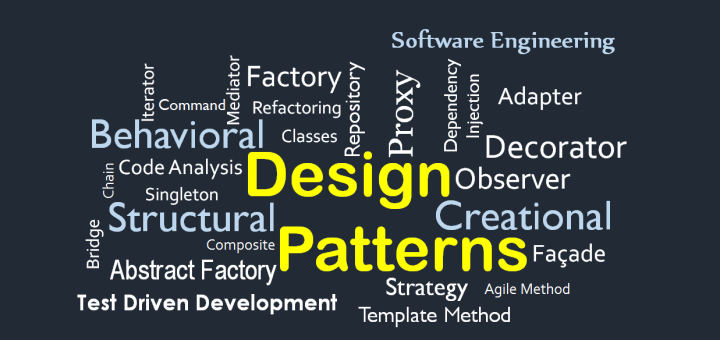

### WHAT'S THAT?
When I was first asked, "What is a design pattern?" I was unable to answer. I have been coding for over three years at this point, but I have never in my life heard about a 'design pattern." However, after asking ChatGPT what a design pattern was and doing some additional research on my own, I realized that the so-called "design pattern" was just a fancy term for some things I've commonly done in my code before.

For example, one "design pattern" is an iterator. An iterator is a tool used to iterate (hence the name iterator) across a collection of items. Your items might be stored in an array, but they could also be stored in a different data structure like a tree. As software engineers, we know that there are different ways to iterate through an array and trees. We can also use different ways to travel through a tree, such as depth-first search and breadth-first search.

So how do iterators solve this problem? An iterator is something we use to go to the next item in a collection. Depending on what type of data structure we are trying to traverse through and how we want to traverse through it, the iterator returns the next item in the collection.

Another example is a factory. A factory is a pattern used to generalize more specific classes. For example, say you created a zoo in your code. Since you just opened your zoo, there is only one animal in your zoo, which is an elephant. But what happens when you want to add more animals to your zoo, since no one wants to go to a zoo with just elephants? You could write the code for another animal like a lion, but as we are adding more animals, we would have to keep doing the same thing. This leads to two problems. The first being that this is repetitive, and as software engineers we don't want to be repetitive. The second is that this makes the code progressively more messy as we add more animals.

So how does a factory solve this problem? A factory is like a superclass for more specific classes. Let's take a quick look at our zoo example. Instead of creating a class for each of the animals, it is more practical to make a superclass called "Animal," with general functions that can be applied to all animals, such as "sleep." Then make a subclass of the "Animal" class for each of the specific animals with more specific functions that are specific to that animal.

### OKAY? YOU STILL HAVEN'T ANSWERED THE QUESTION.
Okay, I haven't exactly answered the question of "What is a design pattern?" but I think that you can form a picture in your head of what a design pattern is. The fancy explanation is that a design pattern is an incomplete template that cannot be directly transformed into code that software engineers can use to solve commonly seen problems when coding. The more basic explanation is that it is a general solution to commonly seen problems when coding. I think at some point in time, we have all used some form of a design pattern but just haven't realized it.
