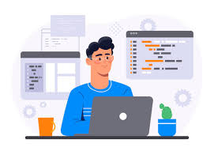

## Reflecting on Software Engineering Concepts Beyond Web Application Development
In this class, I learned about more than just web application development. I also gained a deeper understanding of fundamental software engineering concepts that can be applied across various fields, not just in web development. Specifically, I found that concepts like Agile Project Management and Configuration Management have broader applications that can be useful in diverse types of software projects. These principles are vital for creating good and efficient software, and they extend far beyond the just web applications. In this essay, I will discuss how the ideas of Agile Project Management, particularly Issue Driven Project Management, and Configuration Management can be applied to various software engineering contexts.

## Agile Project Management
Agile Project Management is a concept in software engineering. The core idea of this concept is that we can take large complex projects and break them down into smaller more manageable problems that we can work on.

In ICS 314, we focused on utilizing one form of Agile Project Management called Issue Driven Project Management (IDPM). IDPM looks to break the timeline for the project into multiple sections with clearly defined milestones for each section of the project. So for our final project in ICS 314, we had to create our own working website. We had three different milestones named “M1”, “M2”, and “M3” respectively (I know. So original). For “M1” we had to create the basic outline for what we want our website to look like, “M2” required us to create the basic skeleton for the website, and “M3” required adding something “extra” to the project and cleaning it up. For each of the milestones we had to create issues that we would work on.

But IDPM is not just for applications. Consider a data science project, where the team needs to develop a set of algorithms to process and analyze large datasets. IDPM can still be useful in this case. Issues could include tasks like "optimize data preprocessing code" or "evaluate model performance on test data." Even outside of traditional software applications, Agile practices like Issue Driven Project Management can help ensure that the project remains focused, well-organized, and responsive to changes.

## Coding Standards
Coding standards are another concept in software engineering. Coding standards are a certain way we want to all write our code, so that all our code looks the same. Could you imagine the nightmare that would arise if you had an open-source project, and everyone was writing code with different standards? 

In ICS 314, we decided to have all our code follow the coding standards using ESLint. ESLint is an extension in VSCode, our code editor, that makes sure our code is following some form of a standard, by throwing errors when it is not up to standard. Throughout the entire class, we had to have our code follow ESLint’s coding standards, so that the professors could grade our assignments easier.

However, the idea of making a standard for something can be applied outside of this course. For example, we have writing standards like MLA, which is a certain way we structure our essays so that it is easy to understand where everything is. Or we can apply it to something outside of academics, like keeping your office space organized. I’m sure we all have some form of keeping our office organized and like to keep the same system throughout all the spaces that we have, like our room.
