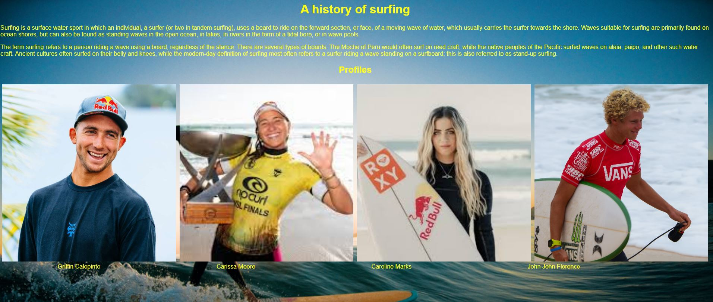
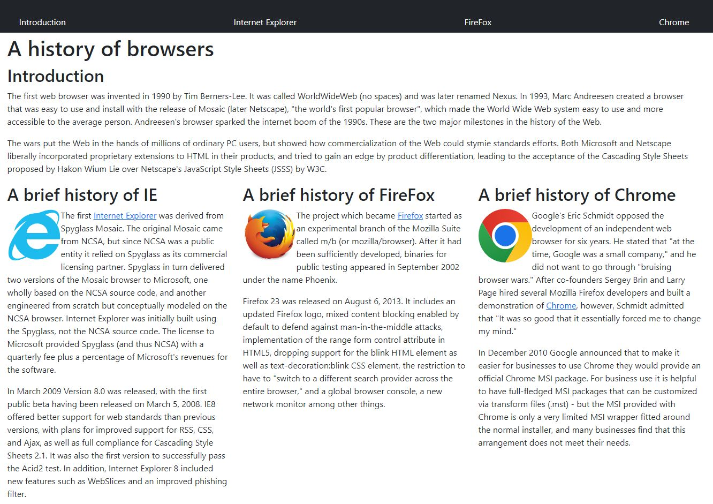

## Background
The time for only using HTML and CSS for our websites is over! Over the years, we have seeen a massive change in websites. They used to be "boring" stand alone pages that didn't really have much user interaction. And during the early ages of the internet, websites were stand alone pages that just blasted information into our faces. They looked uninteresting and frankly hard to look at. Nowdays, websites seem to have a certain requirement/standard. They all seem to have the same couple of traits and features. For instance, its hard to find websites now days that you can't open on your phone and have it look basically the same with some changes to the layout. Or like how almost all websites seem to have a bar at the top that allows you to access other parts of the website. 

## Pure CSS/HTML
Learning the basics on how to use HTML along with CSS is not that difficult in my opinion. HTML is the guideline for how the page is supposed to be layed out, while CSS makes the page look a little prettier. From my personal experience using CSS and HTML, I think they are handy, but it is hard to make web pages actually look good AND feel good using just HTML and CSS. I feel that the pages just look a little lackluster and underwhelming compare to web pages that we see today. Additonally, I think that since HTML and CSS do not have a lot of built in designs, it makes it a lot harder to make a responsive and more dynamic website, since we would need to create everything from scratch. This is why I feel that most websites make using HTML and CSS are underwhelming, since most of the time they do not have features that make them more versatile. Since HTML and CSS do not have built in designs, it is also hard to maintain consistency across multiple web pages. Especially now days, since websites often have links to other part of the website that look the same. Could you imagine having to write the same HTML and CSS to format each page so that it looks the same? That just sounds like such as pain to do. Below is a website that I created using just HTML/CSS.
 

 

## Bootstrap
On the otherhand, I personally think that bootstrap is another form of pain. While the pain in using pure HTML/CSS is that it is difficult to make cool and modern, the pain in bootstrap comes from its difficulty to use. In my personal experience, I've had trouble just getting bootstrap to do what I want it to do. For instance, I would want some text placed a certain way, however the text I wrote would not want to move. Like I would use what is given in the documentation and the text would still not move. Honestly, I find it to be very fustrating and difficult to use when trying to format my webpages. But the benefits that it brings far outweight the negatives. It solves a lot of the issues that are caused by using just HTML/CSS for one. For example, it has built in classes that you can use and that allows for some much needed consistancy. It also allows webpages to function dynamically, changing as the window sizes change, while perserving the placements for everything. Bootstrap also has some cool things such as icons that they make simple. This makes making the icons so much easier as all I have to do is look up the icon and copy paste the code that they give me. If I had to do it in HTML and CSS, I would have to find the image, save it, then insert a  tag that references the image, which sounds like a complete nightmare compared to what I could do with bootstrap. I believe that eventhough bootstrap is super fussy and at times difficult to use/understand, it is something worth learning if you are planning to do more frontend work. Below is a website that I created using bootstrap.
 

 
